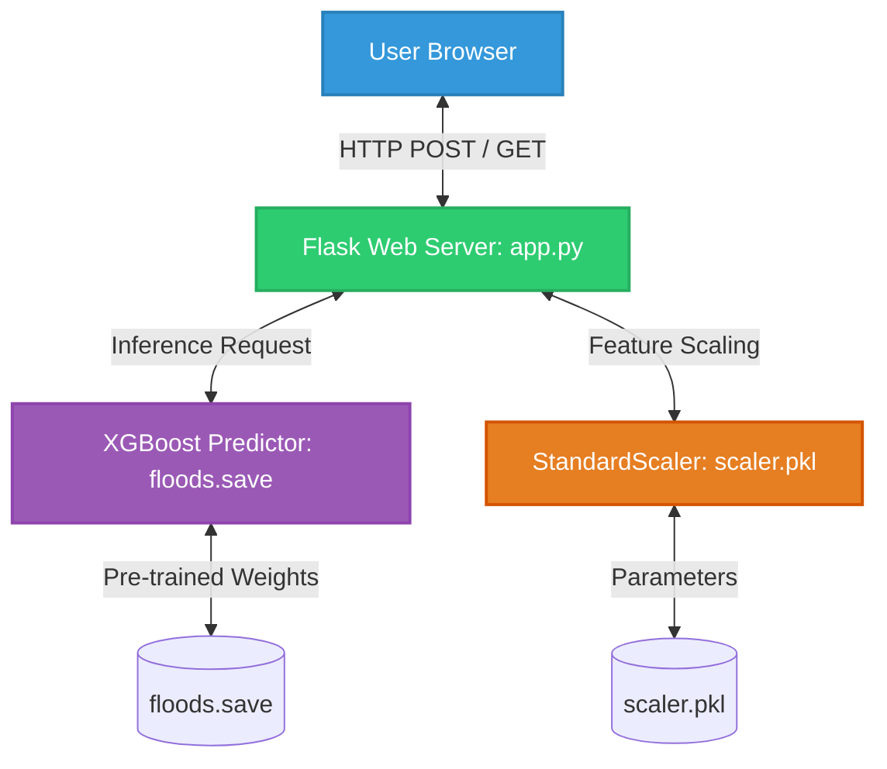
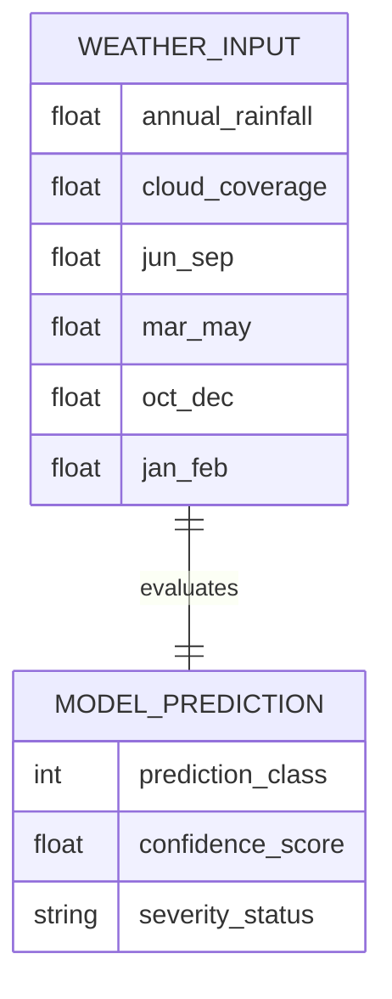

# 🌊 Rising Waters: AI-Powered Flood Prediction System

[](https://www.python.org/)
[](https://flask.palletsprojects.com/)
[](https://scikit-learn.org/)
[](https://xgboost.readthedocs.io/)

**An intelligent, machine-learning-driven flood forecasting application that delivers real-time hazard risk assessments using predictive meteorological features through an interactive web-based interface.**

---

## 📌 Project Overview

**Rising Waters** is a state-of-the-art predictive platform designed to assess and forecast regional flood probabilities. By analyzing critical weather variables—including annual precipitation, cloud cover, and seasonal rainfall breakdowns—the system runs historical data through advanced machine learning classifiers. 

Equipped with a clean and responsive web dashboard built on Flask, the system provides instant, user-friendly risk assessments. This bridges the gap between complex statistical meteorology and actionable early-warning alerts, supporting disaster preparedness, relief organizations, and local communities.

---

## ⚠️ Problem Statement

Extreme flooding incidents cause catastrophic socio-economic damage, human displacement, and loss of life annually. Existing meteorological predictive workflows are often slow, computationally demanding, and inaccessible to the general public. Furthermore, standard forecasting relies heavily on physical simulations that struggle to scale efficiently across regional terrains or process short-term variations dynamically.

There is a vital requirement for an accessible, low-latency machine learning tool that transforms localized precipitation records and atmospheric factors into reliable risk metrics, allowing stakeholders to take pre-emptive safety measures.

---

## 🎯 Objectives

- **Develop a robust ML Pipeline**: Preprocess and scale weather indicators to feed multiple predictive classifiers.
- **Model Evaluation & Optimization**: Train and contrast models (KNN, Decision Trees, Random Forests, XGBoost) to determine the most accurate predictor.
- **Provide Real-Time Inference**: Host the selected champion model on a Flask server for immediate prediction output.
- **Visual Analytics**: Generate comprehensive plots highlighting underlying data trends and relationships.
- **Achieve Production Quality**: Secure low-latency performance and high reliability, validated through performance benchmark testing.

---

## ⚡ Features

| Feature | Details |
| :--- | :--- |
| **🏆 Champion XGBoost Model** | Achieves a top-tier accuracy of **95.42%** for highly dependable classifications. |
| **🤖 Multi-Classifier Engine** | Compares Decision Trees, Random Forests, KNN, and XGBoost classifiers. |
| **📊 Automated Preprocessing** | Handles outlier capping via IQR, handles missing values, and fits `StandardScaler` profiles. |
| **📈 Interactive Visualizations** | Integrates correlation matrices, distribution histograms, and scatter plots. |
| **💻 Responsive Web UI** | Features a premium Glassmorphism-style UI for entering features and viewing predictions. |
| **🚀 Stress-Tested Backend** | Benchmarked under high-load conditions using Apache JMeter (~17ms average response time). |

---

## 🏗️ System Architecture

The application is structured using a clean multi-tiered architecture that keeps components decoupled and maintainable:



### Architecture Description

| Layer | Responsibility | Components |
| :--- | :--- | :--- |
| **🧑‍💻 User Layer** | The interaction layer for endpoints and developers. | Web browser, JMeter client. |
| **🎨 Presentation Layer** | Captures input inputs and renders responses. | HTML5 page templates, static CSS stylesheet. |
| **⚙️ Application Layer** | Directs request routing and application business logic. | Flask server instance (`app.py`). |
| **🧠 Machine Learning Layer** | Translates inputs into predictions. | Standard scaler transformer & trained XGBoost predictor. |
| **💾 Data Layer** | Source storage of structured inputs. | Historical csv records. |

---

## 🗃️ Entity Relationship (ER) Model

The following schema represents the logic map of information passing through the system:



- **User**: Represents a basic user profile recording personal attributes.
- **Weather Input**: Stores parameters collected for prediction, linked back to the user query.
- **Prediction**: Captures final labels and probability scores generated by the model.

---

## 🛠️ Technologies Used

### Core Programming & Scripting
- **Python (v3.10+)**: Language powering the data science pipeline and server backend.

### Machine Learning & Data Processing
- **XGBoost (v2.0.3)**: High-performance gradient boosting library.
- **Scikit-Learn (v1.3.2)**: Core machine learning algorithms, scaling utilities, and validation metrics.
- **Pandas (v2.1.4)** & **NumPy (v1.26.4)**: Structured data manipulation, cleaning, and mathematical operations.
- **Joblib (v1.3.2)**: Efficient serialization and deserialization of the trained models and scaler pipelines.

### Data Visualization
- **Matplotlib (v3.8.4)** & **Seaborn (v0.13.2)**: Static and statistical graphing engines.

### Web Server & Interface
- **Flask (v2.3.3)**: Lightweight WSGI micro-web framework.
- **Gunicorn (v23.0.0)**: Production-grade WSGI HTTP Server.
- **HTML5 & CSS3**: Responsive interfaces with modern Outfit & Inter typography.

### Testing & Infrastructure
- **Apache JMeter**: Heavy-load verification and performance auditing.

---

## 📂 Folder Structure

```text
Rising_Waters_Project_Files/
├── app.py                           # Flask web application entry point
├── requirements.txt                 # Project dependencies
├── README.md                        # Project documentation (Subfolder level)
├── dataset/                         # Dataset folder
│   └── flood_data.csv               # Historical weather & flood training data
├── outputs/                         # Pipeline output assets
│   └── plots/                       # Generated evaluation plots and charts
│       ├── boxplots_by_floods.png
│       ├── class_distribution.png
│       ├── correlation_heatmap.png
│       ├── feature_importance.png
│       ├── model_comparison.png
│       ├── pairplot.png
│       ├── scatter_rainfall_cloud.png
│       └── univariate_distributions.png
├── models/                          # Serialized model artifacts
│   ├── floods.save                  # Saved Champion XGBoost model
│   └── scaler.pkl                   # Saved StandardScaler object
├── notebooks/                       # Modular scripts for training pipeline
│   ├── 01_data_loading.py           # Dataset loading & initial checks
│   ├── 02_visualization.py          # EDA & generation of charts
│   ├── 03_preprocessing.py          # Data cleaning, outlier capping & scaling
│   └── 04_model_training.py         # Complete model comparison & saving script
├── static/                          # Static assets for web UI
│   └── css/
│       └── style.css                # Custom glassmorphism stylesheet
└── templates/                       # HTML template pages
    ├── index.html                   # Landing homepage
    ├── input.html                   # Prediction input form
    ├── result_flood.html            # Results page showing flood risk
    └── result_no_flood.html         # Results page showing safe forecast
```

---

## ⚙️ Installation & Setup

Ensure your local environment is configured by running the following commands from this directory:

### 1. Prerequisites
Ensure you have the following installed on your machine:
- **Python 3.10** or higher
- **pip** (Python package installer)

### 2. Initialize a Virtual Environment
Create a clean environment to manage dependencies:
```bash
# Create the environment
python -m venv venv

# Activate the environment (Windows)
venv\Scripts\activate

# Activate the environment (macOS/Linux)
source venv/bin/activate
```

### 3. Install Project Packages
Install the required packages listed in `requirements.txt`:
```bash
pip install --upgrade pip
pip install -r requirements.txt
```

---

## 🚀 How to Run

### Retraining & Saving the Models (Optional)
The project comes with pre-trained models. However, if you want to rerun the full pipeline, execute:
```bash
python notebooks/04_model_training.py
```
This script will:
- Clean and clip the training data.
- Train the KNN, Decision Tree, Random Forest, and XGBoost classifiers.
- Save comparison metrics and model plots to `outputs/plots/`.
- Save the champion XGBoost classifier (`floods.save`) and `scaler.pkl` to the `models/` directory.

### Generating Visualizations
To produce and view the Exploratory Data Analysis graphs independently:
```bash
python notebooks/02_visualization.py
```

### Starting the Web Server
Launch the Flask development server:
```bash
python app.py
```
After the server initializes, open your browser and navigate to:
```
http://127.0.0.1:5000
```

---

## 🧠 Model Workflow

The machine learning workflow maps data from source files to real-time predictions:


```
📁 Raw Dataset Collection (flood_data.csv)
    ↓
📊 Data Analysis & Visualization (notebooks/02_visualization.py)
    ↓
🔧 Data Preprocessing & Outlier Capping (notebooks/03_preprocessing.py)
    ↓
🤖 Model Comparison & Selection (notebooks/04_model_training.py)
    ↓
🏆 Save Champion Artifact (models/floods.save)
    ↓
🌐 Host Web Application Server (app.py)
    ↓
🧑‍💻 Real-Time User Forecasting (templates/index.html)
```

### Key Prediction Parameters
The model leverages six major inputs for forecasting:
1. **Annual Rainfall**: Total cumulative regional rainfall (mm).
2. **Cloud Coverage**: Average atmospheric cloud coverage percentage (%).
3. **JUN-SEP Rainfall**: Total monsoon-period rainfall (mm).
4. **MAR-MAY Rainfall**: Total pre-monsoon-period rainfall (mm).
5. **OCT-DEC Rainfall**: Total post-monsoon-period rainfall (mm).
6. **JAN-FEB Rainfall**: Total winter-period rainfall (mm).

---

## 🌐 Deployment

For cloud environments and scaling, follow these guidelines:

### Production Web Server
While the Flask development server is excellent for local use, it is not optimized for production. It is recommended to deploy using **Gunicorn** to handle concurrent requests:
```bash
gunicorn --workers 4 --bind 0.0.0.0:5000 app:app
```

### Cloud Platforms
The system can be deployed directly to cloud services such as **Render**, **Heroku**, or **AWS Elastic Beanstalk**:
- Set the build command to: `pip install -r requirements.txt`
- Set the start command to: `gunicorn app:app`
- Ensure the `PORT` environment variable is exposed so the application binds dynamically to the host port.

---

## 🔮 Future Scope

- **Real-Time API Integration**: Connect with live services like OpenWeatherMap to query current weather variables automatically based on GPS location.
- **GIS Heatmap Overlay**: Develop interactive map interfaces that color code regional risk levels.
- **Mobile Companion App**: Deploy mobile clients featuring push notifications and hazard alarms.
- **User Management**: Add authentication to allow users to save past predictions and monitor custom zones.
- **Spatio-Temporal Models**: Implement Deep Learning LSTM models to predict flood timelines based on time-series records.

---

## ✍️ Author

**Pravalika** (Lead Developer)  
Created with a focus on leveraging data science and machine learning for disaster mitigation, early warning systems, and community safety.

For support, feedback, or collaborations, feel free to raise an issue or reach out through the project repository.
